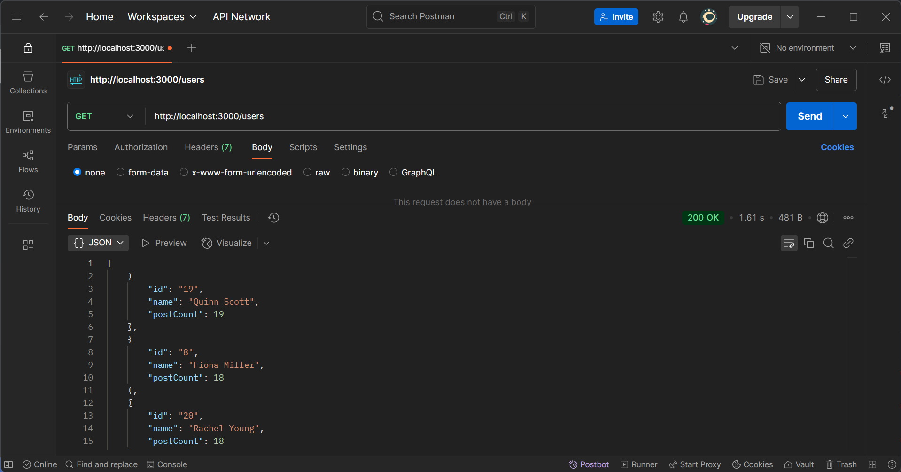

# Social Media Analytics Microservice

## Overview
This project implements a **Social Media Analytics HTTP microservice** using **Express.js**. It consumes only the test server's APIs for users, posts, and comments to generate analytics data.

## Features

### 1. **Top Users API (`GET /users`)**
- Returns the **top five users** with the highest number of posts.
- Fetches user and post data efficiently to minimize API call costs while ensuring real-time accuracy.

### 2. **Top/Latest Posts API (`GET /posts?type=popular` or `type=latest`)**
- **Popular (`type=popular`)**: Returns posts with the most comments.
- **Latest (`type=latest`)**: Returns the five most recent posts.
- Ensures real-time accuracy while minimizing API request overhead.

## API Endpoints

### 1. **Get Top Users**
**Endpoint:** `GET /users`

**Response Example:**
```json
[
  {
    "userId": 1,
    "name": "John Doe",
    "postCount": 45
  },
  {
    "userId": 2,
    "name": "Jane Smith",
    "postCount": 38
  }
]
```

**Successful Request Screenshot:**


### 2. **Get Top/Latest Posts**

#### **Popular Posts**
**Endpoint:** `GET /posts?type=popular`

**Response Example:**
```json
[
  {
    "postId": 101,
    "title": "AI in 2024",
    "commentCount": 120
  },
  {
    "postId": 102,
    "title": "Blockchain Revolution",
    "commentCount": 95
  }
]
```

#### **Latest Posts**
**Endpoint:** `GET /posts?type=latest`

**Response Example:**
```json
[
  {
    "postId": 201,
    "title": "Breaking Tech News",
    "timestamp": "2025-04-02T14:32:00Z"
  },
  {
    "postId": 202,
    "title": "New Programming Trends",
    "timestamp": "2025-04-02T14:15:00Z"
  }
]
```

**Screenshot of Latest Posts:**


**Screenshot of Popular Posts:**


## Setup & Installation
1. Clone the repository:
   ```sh
   git clone https://github.com/arsheymishra/22052805.git
   ```
2. Navigate into the project folder:
   ```sh
   cd 22052805
   ```
3. Install dependencies:
   ```sh
   npm install express axios
   ```
4. Start the server:
   ```sh
   node index.js
   ```
5. The API will be available at `http://localhost:3000` (or your configured port).

## Tools Used
- **Backend:** Node.js, Express.js
- **Testing:** Postman
- **Version Control:** Git & GitHub
